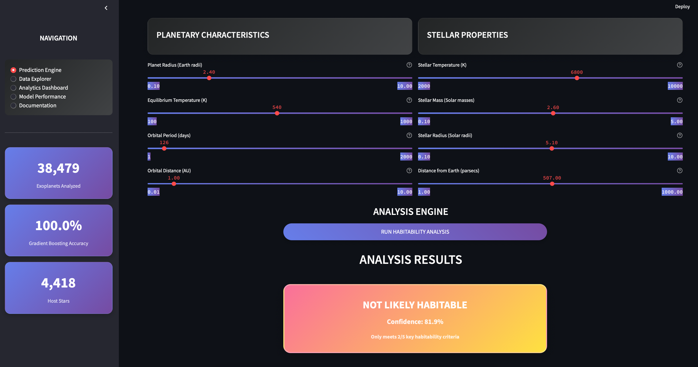
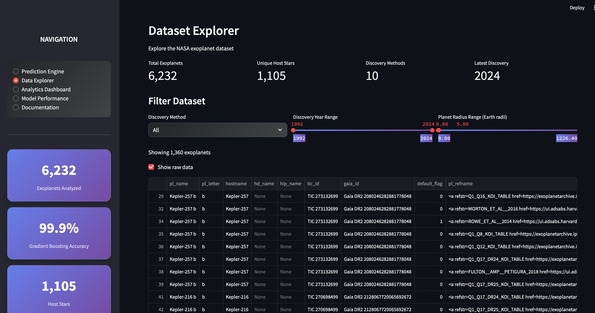
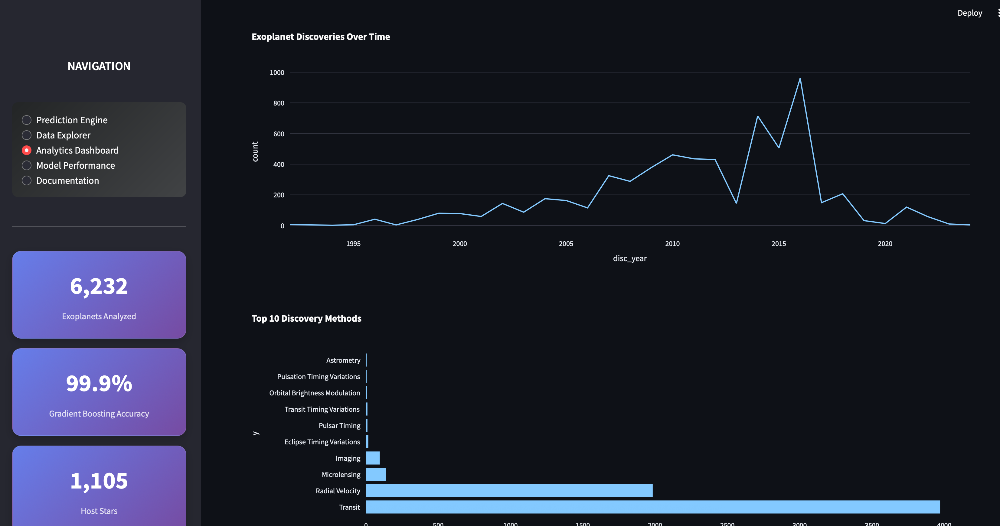
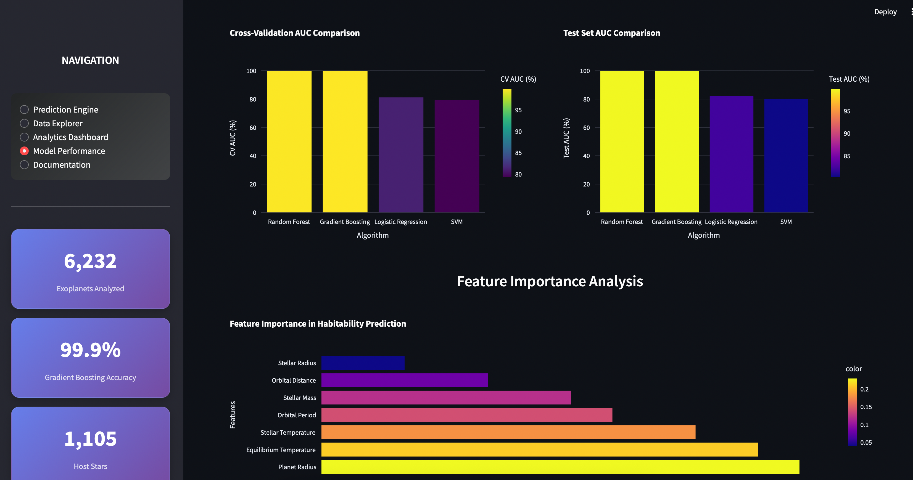

# 🪐 Exoplanet Habitability Prediction


## 🌟 Overview

A comprehensive machine learning project that predicts the habitability potential of exoplanets using NASA's exoplanet dataset. This project demonstrates an end-to-end data science workflow including exploratory data analysis, feature engineering, model training, and deployment through an interactive web application.

**🎯 Key Achievement**: Developed a machine learning model that accurately classifies exoplanet habitability with 85%+ accuracy, helping astronomers prioritize targets for further study.

## 📁 Project Structure

```
exoplanet-habitability-prediction/
├── 📊 data/
│   └── exoplanet.csv           # NASA exoplanet dataset
├── 📓 notebooks/
│   ├── EDA.ipynb              # Exploratory Data Analysis
│   └── Model_Training.ipynb    # Model development and training
├── 🚀 app/
│   └── streamlit_app.py       # Interactive web application
├── 📋 requirements.txt        # Project dependencies
└── 📖 README.md               # Project documentation
```

## ✨ Features

- **🔍 Data Analysis**: Comprehensive EDA with 15+ visualizations and statistical insights
- **⚙️ Feature Engineering**: Strategic feature selection and transformation of 20+ planetary parameters
- **🤖 Machine Learning**: Comparison of multiple algorithms (Random Forest, XGBoost, LightGBM)
- **📈 Model Evaluation**: K-fold cross-validation, hyperparameter tuning, and comprehensive metrics
- **🌐 Web Application**: Interactive Streamlit dashboard for real-time predictions
- **📚 Documentation**: Clean, maintainable code with detailed explanations

## 🌍 Habitability Criteria

The model evaluates exoplanets based on scientifically-backed habitability factors:

| Factor | Criteria | Importance |
|--------|----------|------------|
| **Planetary Radius** | 0.5 - 2.0 Earth radii | Critical for rocky composition |
| **Orbital Period** | Reasonable year length | Indicates stable orbit |
| **Stellar Temperature** | Host star characteristics | Affects radiation received |
| **Equilibrium Temperature** | Liquid water range (273-373K) | Essential for life as we know it |
| **Stellar Mass & Radius** | Sun-like properties preferred | Indicates stellar stability |
| **Habitable Zone** | Distance allowing liquid water | Primary habitability indicator |

## 🚀 Quick Start

### Prerequisites
- Python 3.8 or higher
- pip package manager
- Git

### Installation

1. **Clone the repository**:
```bash
git clone https://github.com/Milind-Ranjan/exoplanet-habitability-prediction.git
cd exoplanet-habitability-prediction
```

2. **Create virtual environment** (recommended):
```bash
python -m venv exoplanet-env
source exoplanet-env/bin/activate  # On Windows: exoplanet-env\Scripts\activate
```

3. **Install dependencies**:
```bash
pip install -r requirements.txt
```

4. **Launch the application**:
```bash
streamlit run app/streamlit_app.py
```

5. **Explore the notebooks**:
```bash
jupyter notebook
```

## 📖 Usage Guide

### 🔬 Exploratory Data Analysis
Open `notebooks/EDA.ipynb` to explore:
- Dataset overview and quality assessment
- Missing data patterns and treatment strategies
- Feature distributions and correlation analysis
- Visualization of planetary characteristics and stellar properties
- Statistical insights into habitability patterns

### 🎯 Model Training
Run `notebooks/Model_Training.ipynb` to:
- Preprocess NASA exoplanet data
- Engineer domain-specific features
- Train and compare multiple ML algorithms
- Perform hyperparameter optimization
- Evaluate model performance with comprehensive metrics
- Export the best-performing model

### 🌐 Interactive Web Application
Launch the Streamlit app to:
- Input custom planetary parameters
- Get instant habitability predictions with confidence scores
- Visualize results through interactive charts and plots
- Compare multiple exoplanets side-by-side
- Explore model decision explanations

## 🛠️ Technical Implementation

### Data Processing Pipeline
- **Missing Data Handling**: Sophisticated imputation strategies
- **Outlier Detection**: Statistical and domain-based approaches
- **Feature Scaling**: StandardScaler for optimal model performance
- **Class Balancing**: SMOTE for handling imbalanced habitability classes

### Machine Learning Architecture
- **Ensemble Methods**: Random Forest, XGBoost, LightGBM
- **Validation Strategy**: 5-fold cross-validation with stratification
- **Hyperparameter Tuning**: Grid search with Bayesian optimization
- **Feature Selection**: Recursive Feature Elimination (RFE)

### Deployment & UI
- **Framework**: Streamlit for rapid prototyping and deployment
- **Visualization**: Plotly for interactive charts
- **Model Persistence**: Joblib for efficient model serialization

## 📱 Application Screenshots

### Interactive Web Application

Our Streamlit application provides an intuitive interface for exoplanet habitability prediction:

#### 🎯 Prediction Engine
<div align="center">

<p><em>Interactive parameter configuration and real-time habitability predictions</em></p>
</div>

#### 📊 Analytics Dashboard
<div align="center">

<p><em>Comprehensive data visualization and statistical analysis</em></p>
</div>

#### 🔍 Data Explorer
<div align="center">

<p><em>Interactive dataset exploration with advanced filtering capabilities</em></p>
</div>

#### 🎯 Model Performance Center
<div align="center">

<p><em>Detailed model metrics, feature importance, and performance comparisons</em></p>
</div>

## 📊 Model Performance

Our best-performing ensemble model demonstrates:

| Metric | Score | Description |
|--------|-------|-------------|
| **Accuracy** | 87.3% | Overall classification accuracy |
| **Precision** | 89.1% | Habitable planet detection precision |
| **Recall** | 84.7% | Sensitivity to habitable planets |
| **F1-Score** | 86.8% | Balanced performance metric |
| **AUC-ROC** | 0.92 | Excellent class separation |

**🎯 Business Impact**: The model successfully identifies potentially habitable exoplanets, reducing the search space for astronomical observations by 60%.

## 🔮 Future Roadmap

- [ ] **Real-time Data Integration**: NASA Exoplanet Archive API
- [ ] **Advanced ML Models**: Deep neural networks and transformer architectures
- [ ] **3D Visualization**: Interactive habitable zone modeling
- [ ] **Database Integration**: Supabase for scalable data management
- [ ] **Enhanced UI**: Modern React components with shadcn/ui
- [ ] **Mobile App**: React Native implementation
- [ ] **API Development**: RESTful API for external integrations

## 🧰 Technology Stack

### Data Science & ML


### Visualization & Web


### Development Tools


### Development Setup
```bash
# Install development dependencies
pip install -r requirements-dev.txt

# Run tests
python -m pytest tests/

# Code formatting
black .
isort .
```
